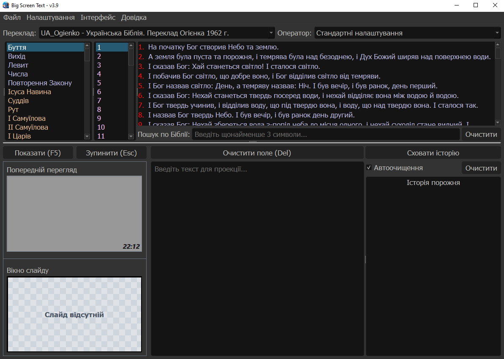
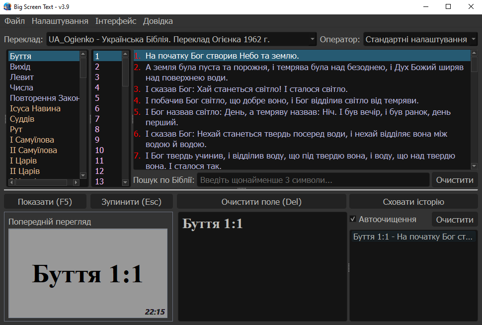
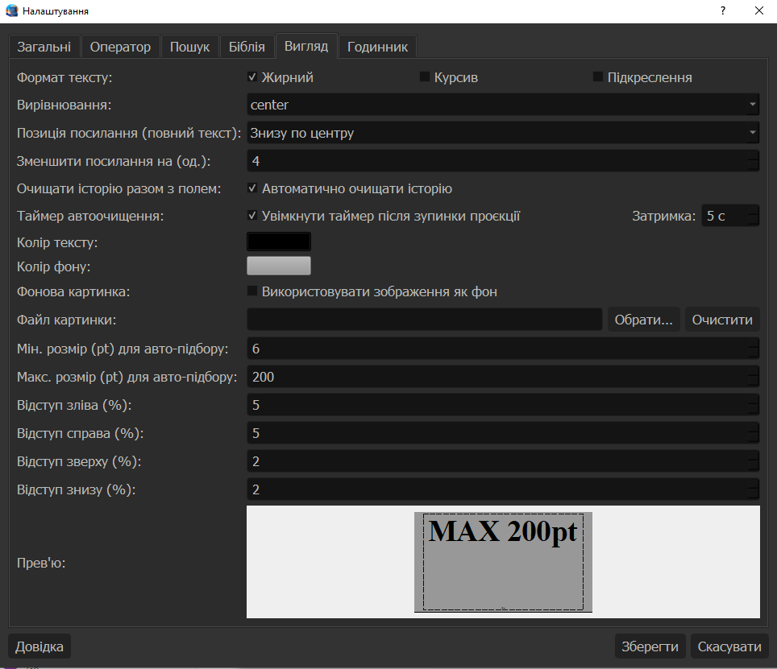
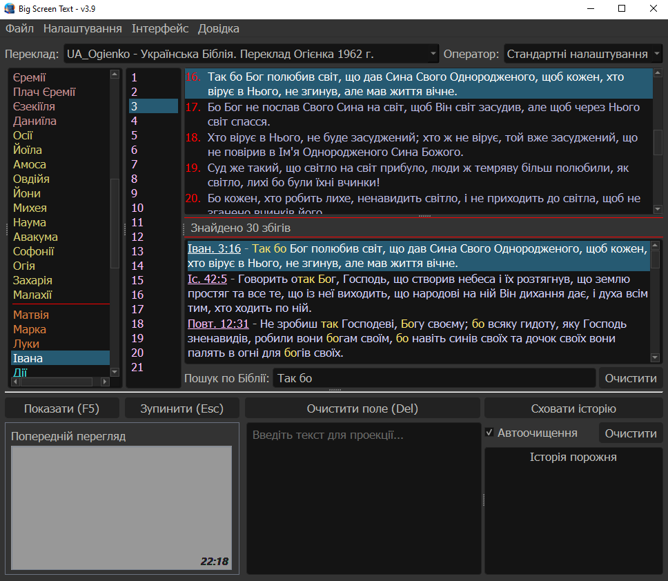

# Big Screen Text

Big Screen Text — це програма для відображення тексту та біблійних віршів на великому екрані (проєкторі). Є безкоштовним аналогом відомої програми VisioBible.

## Знімки екрана

### Головне вікно

### Режим проекції

### Налаштування

### Пошук

## Основні можливості

- Відображення тексту у повноекранному режимі
- Підтримка біблійних модулів
- Швидкий пошук по тексту
- Автоматичне масштабування шрифту
- Гнучкі налаштування стилю (шрифт, колір, вирівнювання)
- Підтримка декількох моніторів
- Режим презентації (F5)
- Попередній перегляд
- Годинник на екрані
- Профілі операторів

## Призначення

Програма розроблена для:
- церков
- проповідей
- презентацій тексту
- відображення біблійних текстів/віршів/посилань

## Вимоги

- Windows 7/10/11
- До 100 Мб дискового простору

## Завантаження

Перейдіть у вкладку **Releases** та завантажте останню версію.

## Запуск

Після завантаження та розпакування архіву відкрийте файл bigscreen_text_vX.X.exe.

## Ліцензія

### Авторські права

© 2026 Андрій Сиротинський. Усі права захищені.

### Умови використання

- Безплатне використання  
- Безплатне розповсюдження  

Дозволено:
- використання для особистих, некомерційних цілей  

Заборонено:
- комерційне використання  
- продаж або перепродаж  
- платне розповсюдження  
- модифікація або реверс-інжиніринг  

### Важливо

Будь-яке порушення цих умов призводить до негайного припинення права використання.

Контакти:  
bigscreentext.support@proton.me

Повний текст ліцензії: [LICENSE](LICENSE.txt)

## Ключові слова (Keywords)

програмне забезпечення для проекторів Біблії, програмне забезпечення для презентацій у церкві, безкоштовна альтернатива VisioBible
